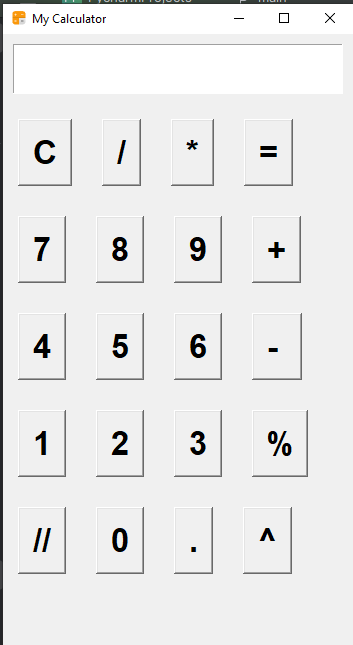

# 🧮 Calculator - Tkinter

A simple yet functional *Calculator application* built using *Python Tkinter* GUI library.  
This project demonstrates basic arithmetic operations with a clean interface and icon support.

---

## 🚀 Features

- ✅ Add, Subtract, Multiply, Divide, Percentage & Floor division
- 🖱 GUI with clickable buttons
- 🔄 Clear functionality
- 🎨 Custom window icon (.ico file)
- 💡 Error handling for invalid inputs

---

## 🛠 Technologies Used

- Python 3.x
- Tkinter (Standard Python GUI library)
- .ico file for branding

---

## 📸 Screenshot

```markdown

